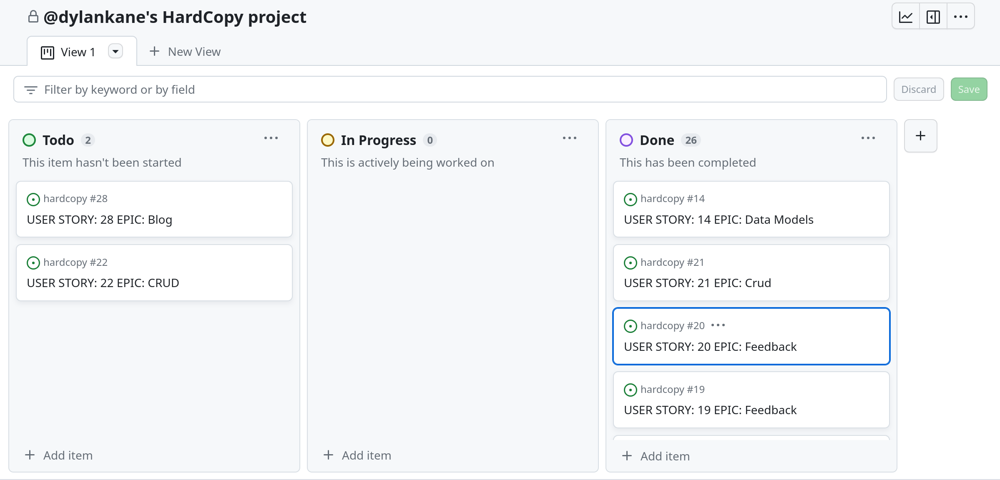

# HARDCOPY
HARD COPY is a e-commerce application. An online vinyl record store. Selling vinyl records from all genres, audio equipment and music themed merchandise.
A market place built to encourage vinyl lovers to come and rumage through the stock and easily make purchases they wont regret. A website with many features and a great UX, with a unique style. HARD COPY is a B2C e-commerce site selling physical products directly to customers. With a payment system using Stripe. A large stock base easily navigated around by category, genre or artists. Features include wishlists, customer reviews and customer ratings of any products. A robust application with users needs at the forefront, and built for staff to easily manage stock and content. The application has been built with Django Frameworks, based on the Python programming language. Front end is rendered with HTML and CSS, helped with the Bootstrap framework. With JavaScript via the jQuery library to manage some front-end logic.

This site aims to bring an easy to use, pleasant space where vinyl enthusiasts will come for all the vinyl needs. Creating a profitable and highly functioning e-commerce platform, that meets the brief for the business needs. A good starting point for a new and growing online store. Easily added to and improved as the business needs change.

I will explain in more detail all the features, tools used, proccesses followed and testing undertaken below.

The live site can be found here:[HARD COPY](https://hard-copy-dca8835ff546.herokuapp.com/)


## UX / UI

The HARD COPY design has been inspired by the old side street record shops, with bins of dusty records, not an all white phone shop. Not aiming to be ultra minimalist or modern in style, but still offering the modern interface features users have come to expect. It is still a clean design without un-needed clutter. The idea is to have easy to find products with intuitive filtering systems. Features like product customer reviews, user currated wishlists, and frictionless payment steps with coherent and consistent style. A style that stands out, a classic / retro feel, dull colours with a 70's feel. The colours and style features are not overpowering , but subtle in their application. A soft backfround colour letting the product images be center of attention. Elements are styled with square corners and well contrasted colours.
### Colour Scheme

The colour scheme is made up of a soft yellow toned off white background colour, paired with a dark brown / red text and element colour, that alone creates the desired design / style. These two colours alternate from background to text where contrast is needed e.g buttons. The other colour used is a variation of the text colour. By lowering its opacity and having it layered over the off white background, it creates a nice colour tone, used to highlight areas, like order detail sections in the cart page.

Other colours used are standard black and white for logo and banners on the hero image, used as a contrast to the rest of the site to stand out, and also a throw back to old black and white price tags. Accent colours are used for special features like delete buttons or pop up message.

- `#f4f1e0` Background colour used throughout the site.
- `#321e1e24` Secondary background colour used to highlight particular areas of pages (Same as text colour but with low opacity).
- `#321e1e;` Main Text.

I used [coolors.co](https://coolors.co/e84610-009fe3-4a4a4f-445261-d63649-e6ecf0-000000) to generate my colour palette.


I've used CSS `:root` variables to easily update the global colour scheme by changing only one value, instead of everywhere in the CSS file.

```css
:root {
    --background: #f4f1e0;
    --background-secondary: #321e1e24;
    --text: #321e1e;
    --text-faded: #9a9a9a;
    --wished: red;
}
```

### Typography

I have used google fints to choose and implement the text fonts. Using Oswald as the main headers / titles font. Its a block letter looking really well when used in uppercase words, stands out and suits the style. The secondary font is Noto Sans, an easy on the eye font, and still has that boxy look that compliments the main font.

FontAwesome was used for all the icons accross the site. Most of which are standard icons that users are used to, making site navigation intuitive, and  keeping text to a minimum. The one icon worth pointing out, that is a bit different, is the hand pointing left or right, for navigating. A slightly unusual choice that helps keep a bit of consistency in the style.


- [Oswald](https://fonts.google.com/specimen/Oswald) was used for the primary headers and titles.

- [Noto Sans](https://fonts.google.com/noto/specimen/Noto+Sans) was used for all other secondary text.

- [Font Awesome](https://fontawesome.com) icons were used throughout the site, such as the social media icons in the footer.

## User Stories

Explain user stories proccess


## Wireframes

To follow best practice, wireframes were developed for mobile, and desktop sizes.
I've used [Balsamiq](https://balsamiq.com/wireframes) to design my site wireframes.

### Home Page Wireframes

| Size | Screenshot |
| --- | --- |
| Mobile |  |
| Desktop |  |
| Desktop 2 |  |

### Poduct Deails Page Wireframes

| Size | Screenshot |
| --- | --- |
| Mobile |  |
| Desktop |  |

### Review Section Wireframes

| Size | Screenshot |
| --- | --- |
| Mobile |  |
| Desktop |  |

### Product Card Wireframes

| Size | Screenshot |
| --- | --- |
| Mobile & Desktop |  |

## Features

In this section the main current features of the application will be outlined, with a brief explanation, and corresponding images.

### Existing Features

- **Nav Bar**

    - At the head of every page a navigation bar is present, simple and effective. With a logo link to the homepage and a search bar to filter products by keywords. On the far right of the nav bar is a section of icons. If logged in there will be a bookmarks icon, and then for all users a profile icon and a shopping cart icon. The Profile icon is a dropdown menu, again displaying different options depending on the users logged in status. If logged-in it will have log out and profile page links, if logged-out in will have log-in or sign up options, and finally if a super user / staff memeber is logged-in, an additional stock management link will be present. The layout of the nav bar changes at different screen sizes. On small screens the seach box is under the rest of the content, if larger screen, the search bar is inline with the rest of the navbar content


- **Banners**

    - At the top of the page and under the hero image, black and white banners are present, diplaying text for free delivery threshold and general info letting the user know imediately what the sites purpose is.


- **Category Navigation**

    - Under the the main nav bar section is a cotegory navigation bar. An inline row of links to pages displaying products of that category. The "vinyls" link is a drop down menu with more links to refine down into the vinyl products, including a link to a page displaying all the genres.


- **Hero Image**

    - On the home page only under all the navigation bars, a large full width hero image is present. An image of a stack of vinyl records with a pair of headphones. Overlayed on this is a logo image. A black circle with the sites name and subtitle, in black and white, matching the banners.


- **Footer**

    - At the foot of every page is a footer section. (good place for it ;) Where the user will find some more navigation links, social media links, company descrption and an area to subscribe to the monthly newsletter. Styled with the secondary background colour to stand out as adifferent section.


- **Product List**

    - The main section of the homepage, an area where all the products are displayed.Each product is displayed on its own card, with some essential info about the item. Including a button to add or remove from the wishlist, an add to cart button, tags for the category and genre the item belongs to (each a link to filter by that particular category or grnre). The artist name is also a filtering link. If the user is a superuser an edit and delete link will be present for the staff to manage stock. The product list will be populated with all products at first, and can be filtered from this page, only changing the items being shown, the rest of the template stays the same. The list shows 12 items and is paginated for anthing more than that. The list area takes up the majority of the screen width, with a sorting / filtering column to the left on large screen, but it takes up full width on smaller screens.


- **Filters**

    - Most of the filtering can be done from a column on the left of the product list. With a sort-by section organising all the stock by price hi-low / low-hi, or year hi-low / low-hi. below is a genres list, which can be scrolled through. Each genre a link to populate the page with stock from that genre, and below that and artist filter list, working the same as the genre list. On smaller screen, this functionallity is moved to 3 drop down buttons at the top od the product list, working the same way. 


- **Product Detail Page**

    - The product detail page is found by clicking the image or title of any item. This page shows the image of the item, on one side with the info to the right. On smaller screens this moves to on top of each other. The info section has all the same featues as the product card on the list, with wishist button, and an add to cart button. It also has a quantity selector to decide a quatity to be added to the cart. It also has a description of the item. Below the image is a keep shopping button bringing the user back to the product list page. Below the detail section is the customer review section


- **Reviews Section**

    - Here all previous reviews of the current product left by other users are displayed. One on top of another. these are displayed in the secondary bacground colour creating a border from other content. The user name and when it ws created is displayed at the top of each review. Below this is the rating they left for the item. displayed as a integer out of 5, and displayed as a corresponding emoticon. A different face depending on the rating left by the user. Under the rating, the main body of the review. On the to of the review section, a counter for the number of reviews and a avg ratings counter. Above that again is a link where a logged in user can get to the page to leave a review.


- **Review Form**

    - On this page a very simple form with a text field for the body of the review and a dropdown list to pick their rating, 1 to 5. To the left of the form an image of the item and some info on it. 


- **Wishlist Controls**

    - On the product card in the product list page and on the product detail page, a wishlist / bookmark button is displayed. If the user is logged it the button will add the item to thier wishlist. if it already exists in their wishlist it will display with a beat efect, and be coloured in solid. if clicked when beating it will remove it from their list.


- **Wishlist Page**

    - The wishlist page accessible from the bookmark icon in the navigation bar, all the items in the logged-in user's wishlist willl be displayed. In a similar format to that of the product list page. However each item card also displays a trash can icon, which will delete the item from the list. The page itself does not have any other features, no filterig or hero image.


- **Genre Page**

    - From the vinyl dropdown in the category nav bar, an option for genres is diplayed. This link will bring the user to a page of all the different music genres. These are displayed as a grid of images, each image represents a genre. With the name printed over the image. Each image / genre is a link to the products list page where all the vinyl records of that genre will be listed.


- **Profile**

    - The profile page consists of a form where the users shipping  details are displayed, if they have saved them when checking out from a previous order. The details can be edited from this from. Or entered, if not already saved. To the left of the form is a section displaying all the current users previous orders, with details of each, order number, date, items and order total. The order number itself is a link to the original success page after that order was purcheased with more info on that order.


- **Cart**

    - The cart page, displays all the items the current user has added to their cart ready to purchase. They are displayed in a table. With the ability to change quantity or remove from cart for each item in the cart. Below that, a box with total cost of items in the cart, total cost of delivery, and a grand total. If the total is over the delivery thereshold, the delivery will be set to 0, if not, the delivery cost will be displayed and added to grand total. And message showing how much more to spend to get free delivery. From here the user can return to the store or head to the checkout to make a purchase.


- **Checkout**

    - In the checkout page a list of the items in the cart is displayed, with the same total, delivery and grand totals shown as the order summary. To the left of that, a form for their details. If their details are saved from previous order or the profile page, the fields of the form will be pre-populated, if not they must be filled in. Below this form, is the stripe card payment widget. Asking for a card number, cvc code and a expiry date for the card. Once details are entered, a secure payment button can be clicked sending the appropriate info to stripe. The page will be overlayed with a opaque layer and a spinning vinyl record, once payment and backend work is finished the checkout success page will appear, or an error message if payment was not completed.


- **About Page**

    - From the footer on any page their is a list of links, contact us, about us, shipping, and T&C's. Each link will bring the user to the same about page, but depending on which link is clicked, it will send them to the appropriate section within that page. The first section is the contact us. From here the user can find all teh details for the different ways to contact the complany, phone number, social icons, email, and a button to send a direct message through the site. This is only available to logged it users. The about section below the contact us section has a few paragraphs about the site and company, below that is the shipping info section, explaining their policy on shipping and returns. And finally the T&C's section is below that. This outlines the terms and condition to the site. Although all these sections are on one page they are easliy accessed through their own links. But once on it, the user can quickly and effortlessly move to the others. Users quite often find themselves in one and realise they need the other.


- **Contact Messaging**

    - In the contact us section of the about us page, there is a link to send a direct message to the company. This link if logged -in will direct the user to a form where they can send a message. this message is stored directly in the sites database and is accessible from the admin panel.


- **Newsletter Subscription**

    - In the footer section of each page, there is a form to subscribe to the monthly newsletter. This ia a simple single email input field, where the user enters their email address and hits submit. If its valid and not already in the database, the user will be notified, and the email saved to the newsletter mailing list.


**Toast Messages**

    - Stored in the base html file is a pop up message box. This appears in the top right of any page, when something on the backend happens where the user has to be notified. For example a form like a review was completed and saved a success message appears, if it wasnt saved, an error message will appear. These are in place site wide for all types of actions. When the user adds something to their cart, a success message is displayed. This will also display an summary of their shopping cart. showing a list of items and totals. They can be triggered for successes, error, alerts and information. A very important part of the application. keeping the user informed of what is happening.


### Future Features

While the site is functioning well and hitting the user stories criteria. A good application is never finished. Future development is needed to increase its robustness, and to offer the customers a better service. I will outline some future feature ideas I have


- Blog
    - A site owner currated blog, sharing other resources to their customers, like top 10 lists of albums, how to clean your turntables needle etc. If these are from good sources, it will also help SEO.
- Increased genre filtering, (sub-genres)
    - A wider range of genres, or a deeper level of genres, e.g within blues, could be bluegrass, delta blues, jump blues etc 
- The reviews
    - The reviews section could be expanded, with more CRUD functionallity from the users end. And make it a more of a comments section.

## Tools & Technologies Used

- [HTML](https://en.wikipedia.org/wiki/HTML) used for the main site content.
- [CSS](https://en.wikipedia.org/wiki/CSS) used for the main site design and layout.
- [CSS :root variables](https://www.w3schools.com/css/css3_variables.asp) used for reusable styles throughout the site.
- [CSS Flexbox](https://www.w3schools.com/css/css3_flexbox.asp) used for an enhanced responsive layout.
- [CSS Grid](https://www.w3schools.com/css/css_grid.asp) used for an enhanced responsive layout.
- [JavaScript](https://www.javascript.com) used for user interaction on the site.
- [Python](https://www.python.org) used as the back-end programming language.
- [Git](https://git-scm.com) used for version control. (`git add`, `git commit`, `git push`)
- [GitHub](https://github.com) used for secure online code storage.
- [GitHub Pages](https://pages.github.com) used for hosting the deployed front-end site.
- [Gitpod](https://gitpod.io) used as a cloud-based IDE for development.
- [Bootstrap](https://getbootstrap.com) used as the front-end CSS framework for modern responsiveness and pre-built components.
- [Materialize](https://materializecss.com) used as the front-end CSS framework for modern responsiveness and pre-built components.
- [Flask](https://flask.palletsprojects.com) used as the Python framework for the site.
- [Django](https://www.djangoproject.com) used as the Python framework for the site.
- [MongoDB](https://www.mongodb.com) used as the non-relational database management with Flask.
- [SQLAlchemy](https://www.sqlalchemy.org) used as the relational database management with Flask.
- [PostgreSQL](https://www.postgresql.org) used as the relational database management.
- [ElephantSQL](https://www.elephantsql.com) used as the Postgres database.
- [Heroku](https://www.heroku.com) used for hosting the deployed back-end site.
- [Cloudinary](https://cloudinary.com) used for online static file storage.
- [Stripe](https://stripe.com) used for online secure payments of ecommerce products/services.
- [AWS S3](https://aws.amazon.com/s3) used for online static file storage.

## Database Design

Entity Relationship Diagrams (ERD) help to visualize database architecture before creating models.
Understanding the relationships between different tables can save time later in the project. Below I have shown a code snippet of each model from each app in the project, below that agian you wil find my database ERD, showing these relationships.

### Shop App

```python
class Category(models.Model):

    class Meta:
        verbose_name_plural = 'Categories'

    name = models.CharField(max_length=254)
    friendly_name = models.CharField(max_length=254, null=True, blank=True)

    def __str__(self):
        return self.name

    def get_friendly_name(self):
        return self.friendly_name


class Genre(models.Model):
    name = models.CharField(max_length=254)
    friendly_name = models.CharField(max_length=254, null=True, blank=True)
    image_url = models.URLField(max_length=1024, null=True, blank=True)
    image = models.ImageField(null=True, blank=True)

    def __str__(self):
        return self.name

    def get_friendly_name(self):
        return self.friendly_name


class Product(models.Model):
    category = models.ForeignKey(
        'Category', null=True, blank=True, on_delete=models.SET_NULL)
    genre = models.ForeignKey(
        'Genre', null=True, blank=True, on_delete=models.SET_NULL)
    sku = models.CharField(max_length=254, null=True, blank=True)
    name = models.CharField(max_length=254)
    artist = models.CharField(max_length=254, null=True, blank=True)
    description = models.TextField()
    release_date = models.PositiveIntegerField(null=True, blank=True)
    price = models.DecimalField(max_digits=6, decimal_places=2)
    image_url = models.URLField(max_length=1024, null=True, blank=True)
    image = models.ImageField(null=True, blank=True)

    def __str__(self):
        return self.name


class WishList(models.Model):
    user = models.ForeignKey(
        User, on_delete=models.CASCADE, related_name='fav')
    product = models.ForeignKey(
        Product, on_delete=models.CASCADE, related_name='fav')

    def __str__(self):
        return self.product.name

```

### Profile App
```python
class UserProfile(models.Model):
    """
    User profile model to manage delivery info and order history
    """
    user = models.OneToOneField(
        User, on_delete=models.CASCADE)
    default_phone_number = models.CharField(
        max_length=20, null=True, blank=True)
    default_street_address1 = models.CharField(
        max_length=80, null=True, blank=True)
    default_street_address2 = models.CharField(
        max_length=80, null=True, blank=True)
    default_town_or_city = models.CharField(
        max_length=40, null=True, blank=True)
    default_county = models.CharField(
        max_length=80, null=True, blank=True)
    default_country = CountryField(
        blank_label='Country', null=True, blank=True)
    default_postcode = models.CharField(
        max_length=20, null=True, blank=True)

    def __str__(self):
        return self.user.username


@receiver(post_save, sender=User)
def create_or_update_user_profile(sender, instance, created, **kwargs):
    """
    Create or update user profiles
    """
    if created:
        UserProfile.objects.create(user=instance)
    instance.userprofile.save()

```

### Reviews App
```python
class CustomerReviews(models.Model):

    class Meta:
        verbose_name_plural = 'customer reviews'

    RATING_CHOICES = (
        (1, '1'),
        (2, '2'),
        (3, '3'),
        (4, '4'),
        (5, '5'),
    )

    product = models.ForeignKey(
        Product, on_delete=models.CASCADE, related_name='review')
    body = models.TextField()
    rating = models.PositiveIntegerField(
        choices=RATING_CHOICES,
        validators=[
            MinValueValidator(1),
            MaxValueValidator(5)])
    created_on = models.DateTimeField(auto_now_add=True)
    updated_on = models.DateTimeField(auto_now=True)
    author = models.ForeignKey(
        User, on_delete=models.CASCADE, related_name='review')

    class Meta:
        ordering = ['created_on']

    def __str__(self):
        return f"Review {self.rating} {self.body} by {self.author}"
```

### Newsletter App
```python
class Newsletter(models.Model):
    email = models.EmailField(
        max_length=254, null=False, blank=False, unique=True)
    subscribed_on = models.DateTimeField(auto_now_add=True)

    class Meta:
        ordering = ['-subscribed_on']

    def __str__(self):
        return self.email

```

### Contact App
```python
class Contact(models.Model):
    author = models.ForeignKey(
        User, on_delete=models.CASCADE, related_name='user_message')
    name = models.CharField(max_length=150)
    email = models.EmailField()
    phone = models.CharField(
        max_length=20, null=True, blank=True)
    subject = models.CharField(max_length=250, null=True, blank=True)
    message = models.TextField()
    date_sent = models.DateTimeField(auto_now_add=True)

    class Meta:
        ordering = ['-date_sent']

    def __str__(self):
        return f"{subject} by {name}"

```

### CheckoutApp
```python
class Order(models.Model):
    order_number = models.CharField(max_length=32, null=False, editable=False)
    user_profile = models.ForeignKey(
        UserProfile,
        on_delete=models.SET_NULL,
        null=True,
        blank=True,
        related_name='orders')
    full_name = models.CharField(max_length=50, null=False, blank=False)
    email = models.EmailField(max_length=254, null=False, blank=False)
    phone_number = models.CharField(max_length=20, null=False, blank=False)
    country = CountryField(blank_label='Country *', null=False, blank=False)
    postcode = models.CharField(max_length=20, null=True, blank=True)
    town_or_city = models.CharField(max_length=40, null=False, blank=False)
    street_address1 = models.CharField(max_length=80, null=False, blank=False)
    street_address2 = models.CharField(max_length=80, null=True, blank=True)
    county = models.CharField(max_length=80, null=True, blank=True)
    date = models.DateTimeField(auto_now_add=True)
    delivery_cost = models.DecimalField(
        max_digits=6, decimal_places=2, null=False, default=0)
    order_total = models.DecimalField(
        max_digits=10, decimal_places=2, null=False, default=0)
    grand_total = models.DecimalField(
        max_digits=10, decimal_places=2, null=False, default=0)
    original_cart = models.TextField(null=False, blank=False, default='')
    stripe_pid = models.CharField(
        max_length=254, null=False, blank=False, default='')

    def _generate_order_number(self):
        """
        Generate a random, unique order number using UUID
        """
        return uuid.uuid4().hex.upper()

    def _generate_order_number(self):
        """
        Generate a random, unique order number using UUID
        """
        return uuid.uuid4().hex.upper()

    def update_total(self):
        """
        Update grand total each time a line item is added,
        accounting for delivery costs.
        """
        self.order_total = self.lineitems.aggregate(
            Sum('lineitem_total'))['lineitem_total__sum'] or 0
        if self.order_total < settings.FREE_DELIVERY_THRESHOLD:
            self.delivery_cost = (
                self.order_total * settings.STANDARD_DELIVERY_PERCENTAGE / 100)
        else:
            self.delivery_cost = 0
        self.grand_total = self.order_total + self.delivery_cost
        self.save()

    def save(self, *args, **kwargs):
        """
        Override the default save method to set the order number
        if it hasn't been set already.
        """
        if not self.order_number:
            self.order_number = self._generate_order_number()
        super().save(*args, **kwargs)

    def __str__(self):
        return self.order_number


class OrderLineItem(models.Model):
    order = models.ForeignKey(
        Order,
        null=False,
        blank=False,
        on_delete=models.CASCADE,
        related_name='lineitems')
    product = models.ForeignKey(
        Product, null=False, blank=False, on_delete=models.CASCADE)
    quantity = models.IntegerField(null=False, blank=False, default=0)
    lineitem_total = models.DecimalField(
        max_digits=6,
        decimal_places=2,
        null=False, blank=False,
        editable=False)

    def save(self, *args, **kwargs):
        """
        Override the save method to set the lineitem total
        and update the order total.
        """
        self.lineitem_total = self.product.price * self.quantity
        super().save(*args, **kwargs)

    def __str__(self):
        return f'SKU {self.product.sku} on order {self.order.order_number}'

```


## Agile Development Process

### GitHub Projects

[GitHub Projects](https://github.com/dylankane/hardcopy/projects) served as an Agile tool for this project.
It isn't a specialized tool, but with the right tags and project creation/issue assignments, it can be made to work.

Through it, user stories, issues, and milestone tasks were planned, then tracked on a weekly basis using the basic Kanban board.




### GitHub Issues

[GitHub Issues](https://github.com/dylankane/hardcopy/issues) served as an another Agile tool.
There, I used my own **User Story Template** to manage user stories.

It also helped with milestone iterations on a weekly basis.

### MoSCoW Prioritization

I've decomposed my Epics into stories prior to prioritizing and implementing them.
Using this approach, I was able to apply the MoSCow prioritization and labels to my user stories within the Issues tab.

- **Must Have**: guaranteed to be delivered (*max 60% of stories*)
- **Should Have**: adds significant value, but not vital (*the rest ~20% of stories*)
- **Could Have**: has small impact if left out (*20% of stories*)
- **Won't Have**: not a priority for this iteration

## Ecommerce Business Model

This site sells goods to individual customers, and therefore follows a `Business to Customer` model.
It is of the simplest **B2C** forms, as it focuses on individual transactions, and doesn't need anything
such as monthly/annual subscriptions.

It is still in its early development stages, although it already has a newsletter, and links for social media marketing.

Social media can potentially build a community of users around the business, and boost site visitor numbers,
especially when using larger platforms such a Facebook.

A newsletter list can be used by the business to send regular messages to site users.
For example, what items are on special offer, new items in stock,
updates to business hours, notifications of events, and much more!

## Search Engine Optimization (SEO) & Social Media Marketing

### Keywords

I've identified some appropriate keywords to align with my site, that should help users
when searching online to find my page easily from a search engine.
This included a series of the following keyword types

- Short-tail (head terms) keywords
- Long-tail keywords

I also played around with [Word Tracker](https://www.wordtracker.com) a bit
to check the frequency of some of my site's primary keywords (only until the free trial expired).

### Sitemap

I've used [XML-Sitemaps](https://www.xml-sitemaps.com) to generate a sitemap.xml file.
This was generated using my deployed site URL: https://hard-copy-dca8835ff546.herokuapp.com

After it finished crawling the entire site, it created a
[sitemap.xml](sitemap.xml) which I've downloaded and included in the repository.

### Robots

I've created the [robots.txt](robots.txt) file at the root-level.
Inside, I've included the default settings:

```
User-agent: *
Disallow:
Sitemap: https://hard-copy-dca8835ff546.herokuapp.com/sitemap.xml
```

Further links for future implementation:
- [Google search console](https://search.google.com/search-console)
- [Creating and submitting a sitemap](https://developers.google.com/search/docs/advanced/sitemaps/build-sitemap)
- [Managing your sitemaps and using sitemaps reports](https://support.google.com/webmasters/answer/7451001)
- [Testing the robots.txt file](https://support.google.com/webmasters/answer/6062598)

### Social Media Marketing

Creating a strong social base (with participation) and linking that to the business site can help drive sales.
Using more popular providers with a wider user base, such as Facebook, typically maximizes site views.

I've created a mockup Facebook business account using the
[Balsamiq template](https://code-institute-org.github.io/5P-Assessments-Handbook/files/Facebook_Mockups.zip)
provided by Code Institute.


### Newsletter Marketing

I have incorporate a newsletter sign-up form on my application, to allow users to supply their
email address if they are interested in learning more. 

⚠️⚠️⚠️⚠️⚠️ START OF NOTES (to be deleted) ⚠️⚠️⚠️⚠️⚠️

Option 1 (MailChimp):
- Sign up for a Mailchimp account
- This allows up to 2,500 subscription email sends per month
- Incorporate the code and scripts into your project like in the CI lessons.

Option 2 (Django):
- Create a custom newsletter app in your project, with a custom model.
- This method satisfies two assessment criteria:
    - include a newsletter
    - one of your custom models
- It doesn't need anything except the "email" on the model.
- Example:
    ```python
    class Newsletter(models.Model):
    email = models.EmailField(null=False, blank=False)

    def __str__(self):
        return self.email
    ```
- Consider using the same `send_mail()` functionality used on the `webhook_handler.py` file.
    - You can trigger an email sent out to subscribed users when new products are added to the site!

🛑🛑🛑🛑🛑 END OF NOTES (to be deleted) 🛑🛑🛑🛑🛑

## Testing

For all testing, please refer to the [TESTING.md](TESTING.md) file.

## Deployment

⚠️⚠️⚠️⚠️⚠️ START OF NOTES (to be deleted) ⚠️⚠️⚠️⚠️⚠️

**IMPORTANT:**
- ⚠️ DO NOT update the environment variables to your own! These should NOT be included in this file; just demo values! ⚠️
- ⚠️ DO NOT update the environment variables to your own! These should NOT be included in this file; just demo values! ⚠️
- ⚠️ DO NOT update the environment variables to your own! These should NOT be included in this file; just demo values! ⚠️

🛑🛑🛑🛑🛑 END OF NOTES (to be deleted) 🛑🛑🛑🛑🛑

The live deployed application can be found deployed on [Heroku](https://hard-copy-dca8835ff546.herokuapp.com).

### ElephantSQL Database

This project uses [ElephantSQL](https://www.elephantsql.com) for the PostgreSQL Database.

To obtain your own Postgres Database, sign-up with your GitHub account, then follow these steps:
- Click **Create New Instance** to start a new database.
- Provide a name (this is commonly the name of the project: hardcopy).
- Select the **Tiny Turtle (Free)** plan.
- You can leave the **Tags** blank.
- Select the **Region** and **Data Center** closest to you.
- Once created, click on the new database name, where you can view the database URL and Password.

### Amazon AWS

This project uses [AWS](https://aws.amazon.com) to store media and static files online, due to the fact that Heroku doesn't persist this type of data.

Once you've created an AWS account and logged-in, follow these series of steps to get your project connected.
Make sure you're on the **AWS Management Console** page.

#### S3 Bucket

- Search for **S3**.
- Create a new bucket, give it a name (matching your Heroku app name), and choose the region closest to you.
- Uncheck **Block all public access**, and acknowledge that the bucket will be public (required for it to work on Heroku).
- From **Object Ownership**, make sure to have **ACLs enabled**, and **Bucket owner preferred** selected.
- From the **Properties** tab, turn on static website hosting, and type `index.html` and `error.html` in their respective fields, then click **Save**.
- From the **Permissions** tab, paste in the following CORS configuration:

	```shell
	[
		{
			"AllowedHeaders": [
				"Authorization"
			],
			"AllowedMethods": [
				"GET"
			],
			"AllowedOrigins": [
				"*"
			],
			"ExposeHeaders": []
		}
	]
	```

- Copy your **ARN** string.
- From the **Bucket Policy** tab, select the **Policy Generator** link, and use the following steps:
	- Policy Type: **S3 Bucket Policy**
	- Effect: **Allow**
	- Principal: `*`
	- Actions: **GetObject**
	- Amazon Resource Name (ARN): **paste-your-ARN-here**
	- Click **Add Statement**
	- Click **Generate Policy**
	- Copy the entire Policy, and paste it into the **Bucket Policy Editor**

		```shell
		{
			"Id": "Policy1234567890",
			"Version": "2012-10-17",
			"Statement": [
				{
					"Sid": "Stmt1234567890",
					"Action": [
						"s3:GetObject"
					],
					"Effect": "Allow",
					"Resource": "arn:aws:s3:::your-bucket-name/*"
					"Principal": "*",
				}
			]
		}
		```

	- Before you click "Save", add `/*` to the end of the Resource key in the Bucket Policy Editor (like above).
	- Click **Save**.
- From the **Access Control List (ACL)** section, click "Edit" and enable **List** for **Everyone (public access)**, and accept the warning box.
	- If the edit button is disabled, you need to change the **Object Ownership** section above to **ACLs enabled** (mentioned above).

#### IAM

Back on the AWS Services Menu, search for and open **IAM** (Identity and Access Management).
Once on the IAM page, follow these steps:

- From **User Groups**, click **Create New Group**.
	- Suggested Name: `group-hardcopy` (group + the project name)
- Tags are optional, but you must click it to get to the **review policy** page.
- From **User Groups**, select your newly created group, and go to the **Permissions** tab.
- Open the **Add Permissions** dropdown, and click **Attach Policies**.
- Select the policy, then click **Add Permissions** at the bottom when finished.
- From the **JSON** tab, select the **Import Managed Policy** link.
	- Search for **S3**, select the `AmazonS3FullAccess` policy, and then **Import**.
	- You'll need your ARN from the S3 Bucket copied again, which is pasted into "Resources" key on the Policy.

		```shell
		{
			"Version": "2012-10-17",
			"Statement": [
				{
					"Effect": "Allow",
					"Action": "s3:*",
					"Resource": [
						"arn:aws:s3:::your-bucket-name",
						"arn:aws:s3:::your-bucket-name/*"
					]
				}
			]
		}
		```
	
	- Click **Review Policy**.
	- Suggested Name: `policy-hardcopy` (policy + the project name)
	- Provide a description:
		- "Access to S3 Bucket for hardcopy static files."
	- Click **Create Policy**.
- From **User Groups**, click your "group-hardcopy".
- Click **Attach Policy**.
- Search for the policy you've just created ("policy-hardcopy") and select it, then **Attach Policy**.
- From **User Groups**, click **Add User**.
	- Suggested Name: `user-hardcopy` (user + the project name)
- For "Select AWS Access Type", select **Programmatic Access**.
- Select the group to add your new user to: `group-hardcopy`
- Tags are optional, but you must click it to get to the **review user** page.
- Click **Create User** once done.
- You should see a button to **Download .csv**, so click it to save a copy on your system.
	- **IMPORTANT**: once you pass this page, you cannot come back to download it again, so do it immediately!
	- This contains the user's **Access key ID** and **Secret access key**.
	- `AWS_ACCESS_KEY_ID` = **Access key ID**
	- `AWS_SECRET_ACCESS_KEY` = **Secret access key**

#### Final AWS Setup

- If Heroku Config Vars has `DISABLE_COLLECTSTATIC` still, this can be removed now, so that AWS will handle the static files.
- Back within **S3**, create a new folder called: `media`.
- Select any existing media images for your project to prepare them for being uploaded into the new folder.
- Under **Manage Public Permissions**, select **Grant public read access to this object(s)**.
- No further settings are required, so click **Upload**.

### Stripe API

This project uses [Stripe](https://stripe.com) to handle the ecommerce payments.

Once you've created a Stripe account and logged-in, follow these series of steps to get your project connected.

- From your Stripe dashboard, click to expand the "Get your test API keys".
- You'll have two keys here:
	- `STRIPE_PUBLIC_KEY` = Publishable Key (starts with **pk**)
	- `STRIPE_SECRET_KEY` = Secret Key (starts with **sk**)

As a backup, in case users prematurely close the purchase-order page during payment, we can include Stripe Webhooks.

- From your Stripe dashboard, click **Developers**, and select **Webhooks**.
- From there, click **Add Endpoint**.
	- `https://hard-copy-dca8835ff546.herokuapp.com/checkout/wh/`
- Click **receive all events**.
- Click **Add Endpoint** to complete the process.
- You'll have a new key here:
	- `STRIPE_WH_SECRET` = Signing Secret (Wehbook) Key (starts with **wh**)

### Gmail API

This project uses [Gmail](https://mail.google.com) to handle sending emails to users for account verification and purchase order confirmations.

Once you've created a Gmail (Google) account and logged-in, follow these series of steps to get your project connected.

- Click on the **Account Settings** (cog icon) in the top-right corner of Gmail.
- Click on the **Accounts and Import** tab.
- Within the section called "Change account settings", click on the link for **Other Google Account settings**.
- From this new page, select **Security** on the left.
- Select **2-Step Verification** to turn it on. (verify your password and account)
- Once verified, select **Turn On** for 2FA.
- Navigate back to the **Security** page, and you'll see a new option called **App passwords**.
- This might prompt you once again to confirm your password and account.
- Select **Mail** for the app type.
- Select **Other (Custom name)** for the device type.
	- Any custom name, such as "Django" or hardcopy
- You'll be provided with a 16-character password (API key).
	- Save this somewhere locally, as you cannot access this key again later!
	- `EMAIL_HOST_PASS` = user's 16-character API key
	- `EMAIL_HOST_USER` = user's own personal Gmail email address

### Heroku Deployment

This project uses [Heroku](https://www.heroku.com), a platform as a service (PaaS) that enables developers to build, run, and operate applications entirely in the cloud.

Deployment steps are as follows, after account setup:

- Select **New** in the top-right corner of your Heroku Dashboard, and select **Create new app** from the dropdown menu.
- Your app name must be unique, and then choose a region closest to you (EU or USA), and finally, select **Create App**.
- From the new app **Settings**, click **Reveal Config Vars**, and set your environment variables.

| Key | Value |
| --- | --- |
| `AWS_ACCESS_KEY_ID` | user's own value |
| `AWS_SECRET_ACCESS_KEY` | user's own value |
| `DATABASE_URL` | user's own value |
| `DISABLE_COLLECTSTATIC` | 1 (*this is temporary, and can be removed for the final deployment*) |
| `EMAIL_HOST_PASS` | user's own value |
| `EMAIL_HOST_USER` | user's own value |
| `SECRET_KEY` | user's own value |
| `STRIPE_PUBLIC_KEY` | user's own value |
| `STRIPE_SECRET_KEY` | user's own value |
| `STRIPE_WH_SECRET` | user's own value |
| `USE_AWS` | True |

Heroku needs two additional files in order to deploy properly.
- requirements.txt
- Procfile

You can install this project's **requirements** (where applicable) using:
- `pip3 install -r requirements.txt`

If you have your own packages that have been installed, then the requirements file needs updated using:
- `pip3 freeze --local > requirements.txt`

The **Procfile** can be created with the following command:
- `echo web: gunicorn app_name.wsgi > Procfile`
- *replace **app_name** with the name of your primary Django app name; the folder where settings.py is located*

For Heroku deployment, follow these steps to connect your own GitHub repository to the newly created app:

Either:
- Select **Automatic Deployment** from the Heroku app.

Or:
- In the Terminal/CLI, connect to Heroku using this command: `heroku login -i`
- Set the remote for Heroku: `heroku git:remote -a app_name` (replace *app_name* with your app name)
- After performing the standard Git `add`, `commit`, and `push` to GitHub, you can now type:
	- `git push heroku main`

The project should now be connected and deployed to Heroku!

### Local Deployment

This project can be cloned or forked in order to make a local copy on your own system.

For either method, you will need to install any applicable packages found within the *requirements.txt* file.
- `pip3 install -r requirements.txt`.

You will need to create a new file called `env.py` at the root-level,
and include the same environment variables listed above from the Heroku deployment steps.

Sample `env.py` file:

```python
import os

os.environ.setdefault("AWS_ACCESS_KEY_ID", "user's own value")
os.environ.setdefault("AWS_SECRET_ACCESS_KEY", "user's own value")
os.environ.setdefault("DATABASE_URL", "user's own value")
os.environ.setdefault("EMAIL_HOST_PASS", "user's own value")
os.environ.setdefault("EMAIL_HOST_USER", "user's own value")
os.environ.setdefault("SECRET_KEY", "user's own value")
os.environ.setdefault("STRIPE_PUBLIC_KEY", "user's own value")
os.environ.setdefault("STRIPE_SECRET_KEY", "user's own value")
os.environ.setdefault("STRIPE_WH_SECRET", "user's own value")

# local environment only (do not include these in production/deployment!)
os.environ.setdefault("DEBUG", "True")
```

Once the project is cloned or forked, in order to run it locally, you'll need to follow these steps:
- Start the Django app: `python3 manage.py runserver`
- Stop the app once it's loaded: `CTRL+C` or `⌘+C` (Mac)
- Make any necessary migrations: `python3 manage.py makemigrations`
- Migrate the data to the database: `python3 manage.py migrate`
- Create a superuser: `python3 manage.py createsuperuser`
- Load fixtures (if applicable): `python3 manage.py loaddata file-name.json` (repeat for each file)
- Everything should be ready now, so run the Django app again: `python3 manage.py runserver`

If you'd like to backup your database models, use the following command for each model you'd like to create a fixture for:
- `python3 manage.py dumpdata your-model > your-model.json`
- *repeat this action for each model you wish to backup*

#### Cloning

You can clone the repository by following these steps:

1. Go to the [GitHub repository](https://github.com/dylankane/hardcopy) 
2. Locate the Code button above the list of files and click it 
3. Select if you prefer to clone using HTTPS, SSH, or GitHub CLI and click the copy button to copy the URL to your clipboard
4. Open Git Bash or Terminal
5. Change the current working directory to the one where you want the cloned directory
6. In your IDE Terminal, type the following command to clone my repository:
	- `git clone https://github.com/dylankane/hardcopy.git`
7. Press Enter to create your local clone.

Alternatively, if using Gitpod, you can click below to create your own workspace using this repository.

[](https://gitpod.io/#https://github.com/dylankane/hardcopy)

Please note that in order to directly open the project in Gitpod, you need to have the browser extension installed.
A tutorial on how to do that can be found [here](https://www.gitpod.io/docs/configure/user-settings/browser-extension).

#### Forking

By forking the GitHub Repository, we make a copy of the original repository on our GitHub account to view and/or make changes without affecting the original owner's repository.
You can fork this repository by using the following steps:

1. Log in to GitHub and locate the [GitHub Repository](https://github.com/dylankane/hardcopy)
2. At the top of the Repository (not top of page) just above the "Settings" Button on the menu, locate the "Fork" Button.
3. Once clicked, you should now have a copy of the original repository in your own GitHub account!

### Local VS Deployment

⚠️⚠️⚠️⚠️⚠️ START OF NOTES (to be deleted) ⚠️⚠️⚠️⚠️⚠️

Use this space to discuss any differences between the local version you've developed, and the live deployment site on Heroku.

🛑🛑🛑🛑🛑 END OF NOTES (to be deleted) 🛑🛑🛑🛑🛑

## Credits

⚠️⚠️⚠️⚠️⚠️ START OF NOTES (to be deleted) ⚠️⚠️⚠️⚠️⚠️

In this section you need to reference where you got your content, media, and extra help from.
It is common practice to use code from other repositories and tutorials,
however, it is important to be very specific about these sources to avoid plagiarism.

🛑🛑🛑🛑🛑 END OF NOTES (to be deleted) 🛑🛑🛑🛑🛑

### Content

⚠️⚠️⚠️⚠️⚠️ START OF NOTES (to be deleted) ⚠️⚠️⚠️⚠️⚠️

Use this space to provide attribution links to any borrowed code snippets, elements, or resources.
A few examples have been provided below to give you some ideas.

Ideally, you should provide an actual link to every resource used, not just a generic link to the main site!

🛑🛑🛑🛑🛑 END OF NOTES (to be deleted) 🛑🛑🛑🛑🛑

| Source | Location | Notes |
| --- | --- | --- |
| [Markdown Builder](https://traveltimn.github.io/markdown-builder) | README and TESTING | tool to help generate the Markdown files |
| [Chris Beams](https://chris.beams.io/posts/git-commit) | version control | "How to Write a Git Commit Message" |
| [W3Schools](https://www.w3schools.com/howto/howto_js_topnav_responsive.asp) | entire site | responsive HTML/CSS/JS navbar |
| [W3Schools](https://www.w3schools.com/howto/howto_css_modals.asp) | contact page | interactive pop-up (modal) |
| [W3Schools](https://www.w3schools.com/css/css3_variables.asp) | entire site | how to use CSS :root variables |
| [Flexbox Froggy](https://flexboxfroggy.com/) | entire site | modern responsive layouts |
| [Grid Garden](https://cssgridgarden.com) | entire site | modern responsive layouts |
| [StackOverflow](https://stackoverflow.com/a/2450976) | quiz page | Fisher-Yates/Knuth shuffle in JS |
| [YouTube](https://www.youtube.com/watch?v=YL1F4dCUlLc) | leaderboard | using `localStorage()` in JS for high scores |
| [YouTube](https://www.youtube.com/watch?v=u51Zjlnui4Y) | PP3 terminal | tutorial for adding color to the Python terminal |
| [strftime](https://strftime.org) | CRUD functionality | helpful tool to format date/time from string |
| [WhiteNoise](http://whitenoise.evans.io) | entire site | hosting static files on Heroku temporarily |

### Media

⚠️⚠️⚠️⚠️⚠️ START OF NOTES (to be deleted) ⚠️⚠️⚠️⚠️⚠️

Use this space to provide attribution links to any images, videos, or audio files borrowed from online.
A few examples have been provided below to give you some ideas.

If you're the owner (or a close acquaintance) of all media files, then make sure to specify this.
Let the assessors know that you have explicit rights to use the media files within your project.

Ideally, you should provide an actual link to every media file used, not just a generic link to the main site!
The list below is by no means exhaustive. Within the Code Institute Slack community, you can find more "free media" links
by sending yourself the following command: `!freemedia`.

🛑🛑🛑🛑🛑 END OF NOTES (to be deleted) 🛑🛑🛑🛑🛑

| Source | Location | Type | Notes |
| --- | --- | --- | --- |
| [Pexels](https://www.pexels.com) | entire site | image | favicon on all pages |
| [Lorem Picsum](https://picsum.photos) | home page | image | hero image background |
| [Unsplash](https://unsplash.com) | product page | image | sample of fake products |
| [Pixabay](https://pixabay.com) | gallery page | image | group of photos for gallery |
| [Wallhere](https://wallhere.com) | footer | image | background wallpaper image in the footer |
| [This Person Does Not Exist](https://thispersondoesnotexist.com) | testimonials | image | headshots of fake testimonial images |
| [Audio Micro](https://www.audiomicro.com/free-sound-effects) | game page | audio | free audio files to generate the game sounds |
| [Videvo](https://www.videvo.net/) | home page | video | background video on the hero section |
| [TinyPNG](https://tinypng.com) | entire site | image | tool for image compression |

### Acknowledgements

⚠️⚠️⚠️⚠️⚠️ START OF NOTES (to be deleted) ⚠️⚠️⚠️⚠️⚠️

Use this space to provide attribution to any supports that helped, encouraged, or supported you throughout the development stages of this project.
A few examples have been provided below to give you some ideas.

🛑🛑🛑🛑🛑 END OF NOTES (to be deleted) 🛑🛑🛑🛑🛑

- I would like to thank my Code Institute mentor, [Tim Nelson](https://github.com/TravelTimN) for their support throughout the development of this project.
- I would like to thank the [Code Institute](https://codeinstitute.net) tutor team for their assistance with troubleshooting and debugging some project issues.
- I would like to thank the [Code Institute Slack community](https://code-institute-room.slack.com) for the moral support; it kept me going during periods of self doubt and imposter syndrome.
- I would like to thank my partner (John/Jane), for believing in me, and allowing me to make this transition into software development.
- I would like to thank my employer, for supporting me in my career development change towards becoming a software developer.
