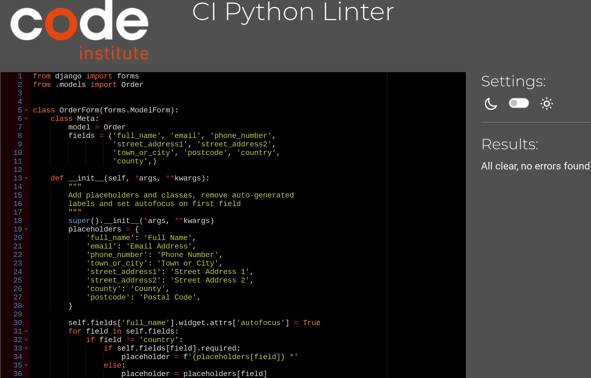
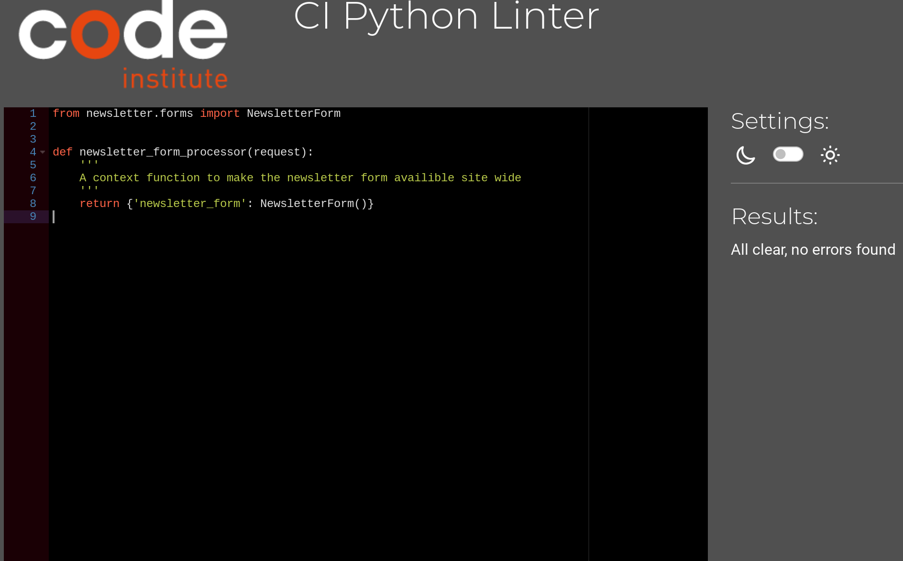
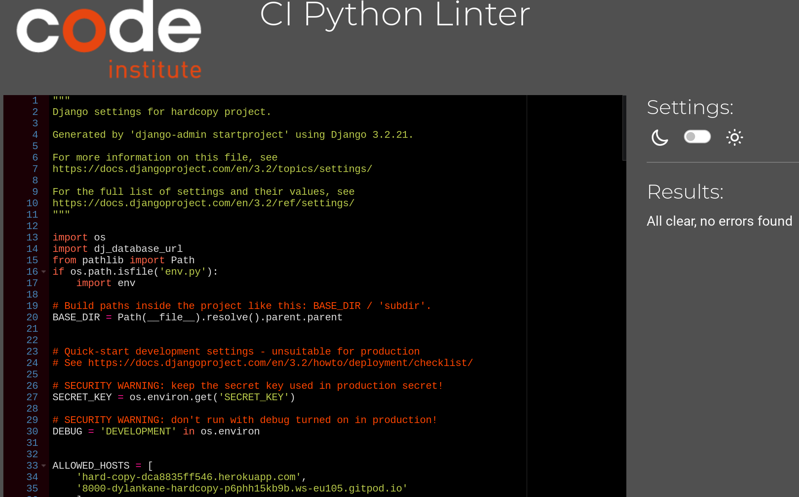

# Testing

Return back to the [README.md](README.md) file.

Below I have outlined the different tests I have undertaken on this project to prove its robustness.

For testing the stipe payment system, the following card numbers can be used for different tests:
Successful payment: 4242424242424242
Failed payment: 4000000000009995
Requires authentication: 4000002500003155

## Code Validation

### HTML

I have used the recommended [HTML W3C Validator](https://validator.w3.org) to validate all of my HTML files.

| Page | Screenshot | Notes |
| --- | --- | --- |
| index.html |  | Pass: No Errors |
| product_detail.html |  | Pass: No Errors |
| list_of_wishes.html |  | Pass: No Errors |
| profile.html |  | Pass: No Errors |
| genre_view.html |  | Pass: No Errors |
| about.html |  | Pass: No Errors |
| add_product.html |  | Pass: No Errors |
| edit_product.html |  | Pass: No Errors |
| cart.html |  | Pass: No Errors |
| checkout.html |  | Pass: No Errors |
| checkout_success.html |  | Pass: No Errors |
| contact_message.html |  | Pass: No Errors |
| add_review.html |  | Pass: No Errors |

### CSS

I have used the recommended [CSS Jigsaw Validator](https://jigsaw.w3.org/css-validator) to validate all of my CSS files.

| File | Screenshot | Notes |
| --- | --- | --- |
| base.css |  | Pass: No Errors |
| checkout.css |  | Pass: No Errors |
| profiles.css |  | Pass: No Errors |

### JavaScript

I have used the recommended [JShint Validator](https://jshint.com) to validate all of my JS files.

| File | Screenshot | Notes |
| --- | --- | --- |
| quantity_input_script.html |  | Pass: No Errors |
| stripe_element.js |  | Undefined Stripe variable |
| cart.html |  | Pass: No Errors |
| base.html |  | Pass: No Errors|

### Python

I have used the recommended [PEP8 CI Python Linter](https://pep8ci.herokuapp.com) to validate all of my Python files.

| File | Screenshot | Notes |
| --- | --- | --- |
| cart/context.py |  | Pass: No Errors |
| cart/views.py |  | Pass: No Errors |
| checkout/admin.py |  | Pass: No Errors |
| checkout/forms.py |  | Pass: No Errors |
| checkout/models.py |  | Pass: No Errors |
| checkout/signals.py |  | Pass: No Errors |
| checkout.urls.py |  | Pass: No Errors |
| checkout.views.py |  | Pass: No Errors |
| checkout/webhook_handler.py |  | Pass: No Errors |
| checkout/webhooks.py |  | Pass: No Errors |
| contact.admin.py |  | Pass: No Errors |
| contact/forms.py |  | Pass: No Errors |
| contact/models.py |  | Pass: No Errors |
| contact/urls.py |  | Pass: No Errors |
| contact/views.py |  | Pass: No Errors |
| hardcopy/context_proccessor.py |  | Pass: No Errors |
| hardcopy/settings.py |  | Pass: No Errors |
| hardcopy.urls.py |  | Pass: No Errors |
| hardcopy/views.py |  | Pass: No Errors |
| newsletter/admin.py |  | Pass: No Errors |
| newsletter/forms.py |  | Pass: No Errors |
| newsletter/models.py |  | Pass: No Errors |
| newsletter/urls.py |  | Pass: No Errors |
| newsletter/views.py |  | Pass: No Errors |
| profiles/forms.py |  | Pass: No Errors |
| profiles/models.py |  | Pass: No Errors |
| profiles/urls.py |  | Pass: No Errors |
| profiles/views.py |  | Pass: No Errors |
| reviews/admin.py |  | Pass: No Errors |
| review/forms.py |  | Pass: No Errors |
| reviews/models.py |  | Pass: No Errors |
| reviews/urls.py |  | Pass: No Errors |
| reviews/views.py |  | Pass: No Errors |
| shop/admin.py |  | Pass: No Errors |
| shop/forms.py |  | Pass: No Errors |
| shop/models.py |  | Pass: No Errors |
| shop/urls.py |  | Pass: No Errors |
| shop/views |  | Pass: No Errors |
| shop/widgets.py |  | Pass: No Errors |
| custom_storage.py |  | Pass: No Errors |


## Browser Compatibility

I've tested my deployed project on multiple browsers to check for compatibility issues.

| Browser | Screenshot | Notes |
| --- | --- | --- |
| Chrome |  | Works as expected |
| Firefox |  | Works as expected |
| Edge |  | Works as expected |

## Responsiveness

I've tested my deployed project on multiple devices to check for responsiveness issues. These tests tested all pages on each device.

| Device | Screenshot | Notes |
| --- | --- | --- |
| Mobile |  | Works as expected |
| Tablet (DevTools) |  | Works as expected |
| Laptop |  | Works as expected |
| XL Monitor |  | Scaling starts to have minor issues |

## Lighthouse Audit

⚠️⚠️⚠️⚠️⚠️ START OF NOTES (to be deleted) ⚠️⚠️⚠️⚠️⚠️

Use this space to discuss testing the live/deployed site's Lighthouse Audit reports.
Avoid testing the local version (especially if developing in Gitpod), as this can have knock-on effects of performance.

If you don't have Lighthouse in your Developer Tools,
it can be added as an [extension](https://chrome.google.com/webstore/detail/lighthouse/blipmdconlkpinefehnmjammfjpmpbjk).

Don't just test the home page (unless it's a single-page application).
Make sure to test the Lighthouse Audit results for all of your pages.

**IMPORTANT**: You must provide screenshots of the results, to "prove" that you've actually tested them.

Sample Lighthouse testing documentation:

🛑🛑🛑🛑🛑 END OF NOTES (to be deleted) 🛑🛑🛑🛑🛑

I've tested my deployed project using the Lighthouse Audit tool to check for any major issues.

| Page | Screenshot | Notes |
| --- | --- | --- |
| Home |  | Some minor warnings |
| Product detail |  | Few warnings |
| Wishlist |  | Some minor warnings |
| Cart |  | Few warnings |
| Genre |  | Slow response time due to large images |
| Checkout |  | Slow response time due to large images |
| About |  | Slow response time due to large images |

## Defensive Programming

### Restricted Areas

Authentication tests were undertaken and passed using the following criteria:
- Users cannot brute-force a URL to navigate to a restricted page
- Users cannot perform CRUD functionality while logged-out
- Non-Authenticated users should not be able to access pages that require authentication
- Standard users should not be able to access pages intended for superusers

The following areas were tested: 
- All auth account pages
- Profile page
- Review form
- Send Message form
- Wish List
- Edit and delete product forms
- Admin panel

All these tests returned appropriate error.

### Forms


### Product Card


### Filters


### Navigation


## Bugs

Below is a list of the main and most time consuming bugs I came accross. It is obviously not all the issues I came up against. But most were fixable with a short head scratch or a look through slack and or google. The usual url pathways and redirects gave plenty of errors when developing, and the inevitable typo issues. Or first iterations of a view function might not have the correct logic.

- HTML validation was finding duplicate id values, in two places.

    - To fix this for the profile and send message pages, I added a prefix to the newletter form, naming it uniquely. Due to the newsletter form being present on all pages, the email field rendered by crispy for each form, was creating a duplicate id value in the rendered html soursce code. The other instance was of duplicate id attribute. This was coming from the custom widget to handle the image file being uploaded to the add and edit product forms. The widget was creating an id attribute, and the element itself had been given an id, for the javascript to target. So the name of the file would be rendered. To fix this I used the id created by the widget for the javascript to target, and removed the redundant id attribute. 

- Error 400 in stripe, making payment intent and charging

    - To fix this, I had to set the port on the local site to public from by gitpod workspace.

- When choosing a genre for a new product in the add_product form, the none option was not available

    - To fix this, I had to add it in as an option in the form class. As the form had a function to get the friendly name of the genres and categories, this removed the default none option. With a lot of trial and error and soe ideas from my mentor, I figured how and where to append the none option to the choices, in the genre field.

- HTML vlaidation on any html page that had a link to the artist filter. The link was been called in a django template tag ```{{ product.artist }}```
which was picking up the spaces in the artist names. Still worked but failed html validation.

    - To fix this, I I tried adding a function to the model to create a url friendly version of the artist, that did work in some places, but not where it was being called from a queryset of a flat list of artists. Eventually finding the solution in stack overflow. Adding |urlencode to the template tag like this  ```{{ product.artist|urlencode }}```

- Wishlist button on the product list. Button would add or remove the item to list. However I couldnt get the button on the page to change appropriately. Either thay all stayed unmarked all they all changed to solid.

    - To fix this, I made a few minor changes to the view function controlling the button logic. The main thing that sorted it out was fixing the redirect url call. By using redirect and parameter and not just render.

- Deleting a product not working

    - To fix this, I found I was missing a trailing slash in the url.

- Getting a working add to cart button on the product list. Was working from the product detail page. 

    - To fix this, I used ```?source=’shop’  ``` as a way to handle the view being called form other places and redirecting where the link was clicked and setting a hidden quantity of 1 so the quantity selector didnt have to be present on the product card.

- Reviews app, could not get the form data to render in the product detail template in the shop app.

    - To fix this, I kept the form in its own html template in the reviews app, and the view for displaying the reviews places in the in the shop app.

- A similar problem to the last one, was getting the newsletter form to render its fields on the footer on every page. This form also coming from its own app.

    - To fix this, with some help (from tutor support) I realised a context processor is what was needed to get the form available across the whole site

- Product images were not showing, when I had deplaoyed and added my nedia files to the aws s3 bucket.

    - To fix this, I had to make changes to my fixture file of all the products and re load data to the database. And change the image pathways accross the code. Initially I had set up the images in the fixture with a pathway to the media folder and then the image file name, and on the templates was calling it the same way. I needed to remove the folder call on the image field in the fixture, and then I changed the template image path to call the image url instead.


## Unfixed Bugs

- SORT-BY. An issue with the filtering needs to be fixed still. While all the 'sort by' and filtering is working. The 'sort by' filters, will only re-order the list of all products and not sort the sub category / genre / artist lists. This was overlooked in the devolpment stage, only realised in testing not leaving enough time to fix. This should just involve a bit of re-structing in the view for the page, that also handles the queries. As the number of products is not extensive yet, this doesnt create too much of an issue, but it is important to fix for a fully functioning ecommerce site with a large inventory.


- PERFORMANCE. Another issue is the loading performance. As seen in the lighthouse tests the performance score is not brilliant. This seems to be mainly down to the images loading. I should have used webp files for the images, although the cross browser compatibilty might not be great. The best solution I can find of for this is to write a function that will convert the images to webp from the code, using a module called django-webp-converter, without having to change all the stored files. With some research it seems there are a few possible ways to achieve this, using 'pillow'. This should still leave the original jpg / png files avaiable for browsers that dont still support webp format. Another thing worth looking into is the caching, and make sure it is set up efficiently.

- LAYOUT. Another issue with the site is the layout of the filtering links. While I think it looks good on large screens the solution, to handling the smaller screens feels a bit klunky. On small screens, the filtering is moved to 3 drop down menus. While it does work and is functioning, but from a design point of view i dont think it works very well. A slution could be a collapsible side menu, that could still be visible on large screens.

- In testing I realised the the newletter form, when completed with an existing email address, it sends a error message, but this message really should be specific to why the form failed, notifyin the user it is due to the email already being subscribed.


Return back to the [README.md](README.md) file.